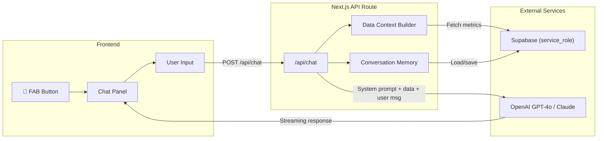

# AI Business Coach — Implementation Plan

> **Feature**: Floating AI assistant panel on the Vie Manly dashboard that acts as a business coach with full access to store data, metrics, and trends.

## Mockup


---

## Architecture Overview



---

## Tech Stack

| Component | Technology | Why |
|---|---|---|
| **AI SDK** | `ai` (Vercel AI SDK v4) | Built for Next.js, handles streaming, tool calling, supports multiple providers |
| **AI Provider** | OpenAI `gpt-4o` or Anthropic `claude-3.5-sonnet` | Best reasoning for business analysis. Start with OpenAI (cheaper at scale), switch to Claude if deeper reasoning needed |
| **API Route** | Next.js App Router `route.ts` | Server-side, can use service_role key, runs on Vercel edge/serverless |
| **Memory** | Supabase table `coach_conversations` | Persistent conversation history, enables context across sessions |
| **Streaming** | Vercel AI SDK `streamText()` | Real-time token-by-token response rendering |
| **UI** | React + Framer Motion | Smooth panel animations, consistent with dashboard design |

### NPM Packages to Install

```bash
npm install ai @ai-sdk/openai
# OR for Claude:
npm install ai @ai-sdk/anthropic
```

### Environment Variables (Vercel Dashboard)

```
OPENAI_API_KEY=sk-...          # OpenAI API key
# OR
ANTHROPIC_API_KEY=sk-ant-...   # Anthropic API key
```

> [!IMPORTANT]
> These keys go in **Vercel Environment Variables** (Settings → Environment Variables), NOT in `.env` files committed to git.

---

## Data Context System

The AI needs access to current business data. Before each AI call, the API route fetches relevant metrics and injects them as context. This is the **key differentiator** — the AI doesn't just chat, it has real data.

### Context Builder — What Data to Include

| Data Category | Source Table/RPC | Refresh Frequency |
|---|---|---|
| **Today's snapshot** | `daily_store_stats` (latest row) | Every request |
| **Period KPIs** | `daily_store_stats` (last 7d, 30d, MTD) | Every request |
| **Category breakdown** | `daily_category_stats` (last 30d, grouped) | Every request |
| **Labour metrics** | `staff_shifts` (last 30d) | Every request |
| **Trends** | `daily_store_stats` (last 90d for trend calc) | Every request |
| **Member stats** | `member_daily_stats` aggregation | On-demand |
| **Inventory alerts** | `inventory_intelligence` (low stock) | On-demand |
| **Historical comparison** | Same period last year | On-demand |

### Context Builder Function

```typescript
// lib/ai/context-builder.ts
import { createClient } from "@supabase/supabase-js";

const supabaseAdmin = createClient(
  process.env.NEXT_PUBLIC_SUPABASE_URL!,
  process.env.SUPABASE_SERVICE_ROLE_KEY!  // Server-side only!
);

export async function buildBusinessContext() {
  const today = new Date().toISOString().slice(0, 10);
  const last30d = new Date(Date.now() - 30 * 86400000).toISOString().slice(0, 10);
  const last7d = new Date(Date.now() - 7 * 86400000).toISOString().slice(0, 10);

  const [
    todayStats,
    last7dStats,
    last30dStats,
    categoryBreakdown,
    labourData,
    lowStockItems,
  ] = await Promise.all([
    supabaseAdmin.from("daily_store_stats").select("*").eq("date", today).single(),
    supabaseAdmin.from("daily_store_stats").select("*").gte("date", last7d).lte("date", today).eq("is_closed", false),
    supabaseAdmin.from("daily_store_stats").select("*").gte("date", last30d).lte("date", today).eq("is_closed", false),
    supabaseAdmin.from("daily_category_stats").select("*").gte("date", last30d).lte("date", today),
    supabaseAdmin.from("staff_shifts").select("shift_date, labour_cost, business_side").gte("shift_date", last30d),
    supabaseAdmin.from("inventory_intelligence").select("*").eq("alert_status", "critical").limit(10),
  ]);

  // Aggregate into a concise summary for the AI
  const stats30d = last30dStats.data || [];
  const totalSales30d = stats30d.reduce((s, r) => s + r.total_net_sales, 0);
  const totalTx30d = stats30d.reduce((s, r) => s + r.total_transactions, 0);
  const avgDailySales = totalSales30d / (stats30d.length || 1);
  
  // ... build comprehensive summary object
  
  return `
## Current Business Snapshot (${today})
- Today's sales: $${todayStats.data?.total_net_sales?.toFixed(0) || "N/A"}
- Today's transactions: ${todayStats.data?.total_transactions || "N/A"}

## Last 7 Days
- Total sales: $${/* calc */0}
- Avg daily: $${/* calc */0}
- vs prior 7d: ${/* calc */"+X%"}

## Last 30 Days
- Total sales: $${totalSales30d.toFixed(0)}
- Avg daily sales: $${avgDailySales.toFixed(0)}
- Total transactions: ${totalTx30d}
- Avg daily transactions: ${(totalTx30d / (stats30d.length || 1)).toFixed(0)}

## Category Breakdown (30d)
${/* category table */""} 

## Labour (30d)
- Total cost: $${/* calc */0}
- Labour vs Sales: ${/* calc */0}%

## Inventory Alerts
${lowStockItems.data?.map(i => `- ⚠️ ${i.item_name}: ${i.days_of_stock} days left`).join("\n") || "No critical alerts"}
  `;
}
```

---

## System Prompt

This is the personality and instruction set for the AI coach:

```
You are VIE Business Coach — an AI-powered business advisor for VIE Market, 
an organic grocery and cafe in Manly, Sydney (NSW 2095).

## Your Role
You are a friendly, data-driven business coach who helps the store owner 
(Phil) make better decisions. You have REAL-TIME access to the store's 
actual sales, labour, inventory, and customer data.

## Business Context
- VIE Market is an organic grocery + cafe at Shop 16/17, 25 Wentworth St, Manly
- Two sides: Cafe (~30% of sales, ~70% margin) and Retail grocery (~70% of sales, ~41% margin)
- Store opened August 20, 2025 (new ownership — historical CSV data available from Jan 2024)
- POS: Square | Dashboard: Next.js on Vercel | DB: Supabase
- Financial Year: Australian (July 1 — June 30)
- Store open 7 days/week. Typical daily revenue: $5,000-$7,500

## Your Style
- Be concise and actionable — busy business owner, not reading essays
- Lead with the insight, then support with data
- Use $ amounts and % changes — be specific, never vague
- When suggesting actions, estimate the potential $ impact
- Use emoji sparingly for visual clarity (📈 📉 ⚠️ 💡 ✅)
- If asked for a simulation, show before/after numbers clearly
- Proactively flag anomalies (sales dips, cost spikes, trending categories)

## What You Can Do
1. **Daily/Weekly Briefings**: Summarise performance with key highlights
2. **Trend Analysis**: Identify patterns (best/worst days, seasonal shifts)
3. **What-If Scenarios**: "What if we increase cafe prices by 5%?"
4. **Labour Optimization**: Flag over/under-staffed days
5. **Category Insights**: Which products are driving/dragging performance
6. **Customer Analysis**: Member vs non-member trends, loyalty program ROI
7. **Inventory Alerts**: Low-stock items, slow movers, reorder timing
8. **Goal Tracking**: Track progress toward targets
9. **Competitor Context**: General retail/cafe industry benchmarks

## Data Available to You
Below is the REAL store data — use it to ground your responses:

{BUSINESS_CONTEXT}

## Rules
- NEVER fabricate data — only reference numbers from the context above
- If asked about data you don't have, say so and suggest how to get it
- Keep responses under 300 words unless a detailed analysis is requested
- Always end with a concrete next step or question to drive action
```

---

## Conversation Memory

### Supabase Table

```sql
CREATE TABLE coach_conversations (
    id uuid DEFAULT gen_random_uuid() PRIMARY KEY,
    session_id text NOT NULL,           -- groups messages in a session
    role text NOT NULL CHECK (role IN ('user', 'assistant', 'system')),
    content text NOT NULL,
    context_snapshot jsonb,             -- business data at time of message
    created_at timestamptz DEFAULT now()
);

CREATE INDEX idx_coach_conv_session ON coach_conversations (session_id, created_at);
ALTER TABLE coach_conversations ENABLE ROW LEVEL SECURITY;
CREATE POLICY "service_role_all" ON coach_conversations FOR ALL TO service_role USING (true);
```

### Memory Strategy

1. **Short-term**: Last 10 messages kept in chat state (React state)
2. **Medium-term**: Full conversation saved to `coach_conversations` table after each exchange
3. **Long-term**: Weekly auto-summary of conversations (could be a scheduled edge function)

---

## UI Components

### 1. Floating Action Button (FAB)

```
Position: fixed, bottom-right (bottom: 24px, right: 24px)
Size: 56×56px (mobile: 48×48)
Style: Olive green (#6B7355) circle with sparkle icon
Animation: Subtle pulse when idle, bounce on new insights
Z-index: 50 (above everything)
Click: Toggles chat panel open/closed
Badge: Optional red dot for unread AI suggestions
```

### 2. Chat Panel

```
Position: fixed, bottom-right (above FAB)
Size: 400×600px (mobile: full screen)
Animation: Slide up + fade in (Framer Motion)
Header: "VIE Business Coach" + close button
Body: Scrollable message area with auto-scroll
Footer: Input field + send button + quick action chips
```

### 3. Quick Action Chips

Pre-built prompts the user can tap instead of typing:

| Chip | Prompt Sent |
|---|---|
| 📊 Today's Summary | "Give me a quick summary of today's performance so far" |
| 📈 Weekly Trends | "What were the key trends this week? Any anomalies?" |
| 💡 Growth Ideas | "Based on my data, what's one thing I should try this week?" |
| 🔮 What-If | "What would happen if I increased cafe prices by 10%?" |
| ⚠️ Alerts | "Are there any issues I should know about right now?" |
| 👥 Members | "How is the loyalty program performing? Any insights?" |

---

## API Route

```typescript
// app/api/chat/route.ts
import { streamText } from "ai";
import { openai } from "@ai-sdk/openai";
import { buildBusinessContext } from "@/lib/ai/context-builder";

export async function POST(req: Request) {
  const { messages, sessionId } = await req.json();

  // Build fresh business context for each request
  const businessContext = await buildBusinessContext();

  // System prompt with live data injected
  const systemPrompt = SYSTEM_PROMPT.replace("{BUSINESS_CONTEXT}", businessContext);

  const result = streamText({
    model: openai("gpt-4o"),
    system: systemPrompt,
    messages,
    maxTokens: 1000,
    temperature: 0.7,
  });

  return result.toDataStreamResponse();
}
```

---

## Estimated Costs

| Item | Cost | Notes |
|---|---|---|
| OpenAI GPT-4o | ~$0.005/request | ~2K input tokens + 500 output avg |
| Vercel Edge Function | Free tier | Included in Vercel Pro |
| Supabase storage | Negligible | Text conversation logs |
| **Monthly estimate** | **$5–15/month** | At 50-100 queries/day |

> [!TIP]
> Start with `gpt-4o-mini` ($0.0003/request) for testing, upgrade to `gpt-4o` for production quality.

---

## Implementation Steps

### Phase 1: Core Chat (2-3 hours)
1. `npm install ai @ai-sdk/openai`
2. Create `app/api/chat/route.ts` with streaming
3. Create `lib/ai/context-builder.ts` 
4. Create `components/coach/coach-fab.tsx` (FAB button)
5. Create `components/coach/coach-panel.tsx` (chat panel)
6. Add to `app/layout.tsx`
7. Set `OPENAI_API_KEY` in Vercel env vars

### Phase 2: Rich Context (1-2 hours)
8. Build comprehensive `buildBusinessContext()` with all metrics
9. Add quick action chips
10. Style messages with markdown rendering
11. Add typing indicator animation

### Phase 3: Memory & Polish (1-2 hours)
12. Create `coach_conversations` table
13. Save/load conversation history
14. Add session management (new chat / continue)
15. Edge cases: error handling, rate limiting, loading states

### Phase 4: Smart Features (ongoing)
16. Proactive daily briefing (auto-generated on first open each day)
17. Anomaly detection alerts (badge on FAB)
18. Inline mini-charts in responses (optional, Recharts)
19. Export conversation as PDF/report

---

## Security Considerations

> [!WARNING]
> The API route uses `SUPABASE_SERVICE_ROLE_KEY` server-side. This key must NEVER be exposed to the client. The chat API route runs on the server, so this is safe — but double-check no client-side imports leak it.

- **Rate limiting**: Add IP-based rate limiting (10 requests/minute per user)
- **Input sanitization**: The AI should not execute arbitrary queries — it only reads pre-assembled context
- **No PII in logs**: Don't log customer names/emails in conversation history
- **API key rotation**: OpenAI key should be rotatable without redeployment (use Vercel env vars)
